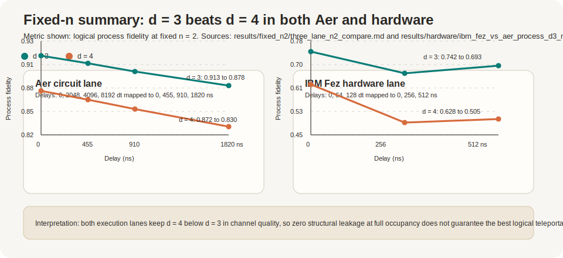

# TeleportDim

**On real IBM hardware, the full-occupancy teleportation channel was worse.**

At fixed physical qubit count `n=2` on `ibm_fez`, saved hardware process tomography gives a zero-delay process fidelity of `0.7421` for `d=3` and `0.6277` for `d=4`.

| dimension | fill ratio `d/2^n` | zero-delay process fidelity | leakage interpretation |
| --- | ---: | ---: | --- |
| `d=3` | `0.75` | `0.7421` | one unused computational state, so leakage is measurable |
| `d=4` | `1.00` | `0.6277` | no unused leakage subspace by definition |

That raises the question this repository is built around:

> If `d=4` has structurally zero leakage, why is its logical teleportation channel worse than `d=3`?

TeleportDim studies fixed-qubit quantum teleportation as a channel-deformation experiment. It varies the encoded logical dimension inside the same physical Hilbert space, then separates ordinary state fidelity from leakage, in-subspace fidelity, process fidelity, and average gate fidelity. The current hardware result suggests that zero leakage at full occupancy does not automatically imply the best logical teleportation channel.



The live-run narrative is part of the artifact: [`docs/hardware_run_notes_ibm_fez.md`](docs/hardware_run_notes_ibm_fez.md) records what ran, what looked suspicious, what had to be rerun, and how the interpretation changed. Exact queue durations and job IDs were not preserved in the committed artifacts, so the note also marks that as a reproducibility gap for the next hardware pass.

If you want the sequence of wrong assumptions and course corrections, read [RESEARCH_JOURNAL.md](RESEARCH_JOURNAL.md).

I built this after [FieldLine VQE](https://github.com/Peterkivol4/Tfim-vqe-symmetry-bench) and [SpinMesh Runtime](https://github.com/Peterkivol4/Runtime-Aware-QAOA-for-Constrained-J1-J2-Ising-Ground-State-Search) left me with the same unresolved problem: I could tell the answer was being deformed, but dimension, qubit count, and execution were still tangled together. [LayerField QAOA](https://github.com/Peterkivol4/portfolio-qaoa-characterization) is the earlier repo that made me start worrying about hidden confounding in the first place. TeleportDim is where I tried to hold the hardware budget fixed and make the deformation easier to read.

## Core Question

Given a fixed physical qubit budget, how do encoded dimension and structured noise deform the logical teleportation channel, and can those deformations be classified from tomography-derived observables?

The project is not just asking whether `d=3` or `d=4` has higher fidelity. It asks whether the observed failure is dominated by unused-subspace leakage, logical damage inside the code subspace, finite-shot tomography variance, circuit-level noise, or hardware-specific channel distortion.

## What Is Demonstrated

- Fixed-`n` comparison across `d=2,3,4` at `n=2`.
- Theory, Aer, and IBM hardware lanes with shared JSON/CSV/Markdown result formats.
- State tomography and process tomography for the same hardware backend.
- Bootstrap confidence intervals on tomography-derived metrics.
- Channel-body deformation records and fingerprint matching against hardware-like records.
- Hardware run notes that document what ran, what looked strange, and what changed the interpretation.

## What Is Exploratory

- Body fingerprint matching is phenomenological, not a microscopic noise-source identification.
- The random-telegraph memory model is calibrated to an effective decay timescale, not fitted to backend noise spectroscopy.
- The theory leakage lane is a baseline model, not the same physical leakage mechanism as Aer or hardware.
- The hardware results are saved for `ibm_fez`; broader device generality still requires additional backend runs.

## Repository Map

- `src/teleportdim/`: typed package implementation.
- `src/teleportdim/noise_bodies.py`: channel-body configurations and effective body models.
- `src/teleportdim/deformation.py`: deformation-vector schema and metrics.
- `src/teleportdim/body_sweeps.py`: controlled channel-body sweeps.
- `src/teleportdim/fingerprinting.py`: hardware-vs-body fingerprint comparison.
- `results/`: committed JSON/CSV/Markdown result artifacts.
- `docs/teleportdim_channel_body_paper.md`: current channel-deformation research framing.
- `docs/teleportdim_fixed_n_paper.md`: supporting fixed-`n` manuscript draft.
- `docs/hardware_run_notes_ibm_fez.md`: experimental narrative for the live IBM run.
- `examples/`: small script entry points for local workflows.
- `tests/`: strict typed validation suite.

## Install

```bash
pip install -e .[dev]
```

Optional quantum-stack extras:

```bash
pip install -e .[aer]
pip install -e .[ibm]
pip install -e .[full]
```

## Reproduce The Current Result Set

```bash
make test
make theory
make aer
make nonmarkovian
make three-lane-report
```

Hardware targets require an initialized IBM Quantum account:

```bash
make hardware-live
make hardware-process-live
```

## Channel-Body Workflow

Generate controlled deformation fingerprints:

```bash
teleportdim channel-body-sweep \
  --n-values 2 \
  --dimensions 2,3,4 \
  --bodies ideal,dephasing,amplitude_damping,leakage_mixing,random_telegraph,coherent_z_drift \
  --strengths 0,0.001,0.005,0.01 \
  --delays 0,64,128 \
  --shots 4096 \
  --samples 1024 \
  --output-stem results/channel_body/n2_body_sweep
```

Compare the modeled fingerprints against the saved `ibm_fez` hardware process-tomography result:

```bash
teleportdim compare-body-fingerprints \
  --input-json results/channel_body/n2_body_sweep.json \
  --hardware-json results/hardware/ibm_fez_process_fixed_n2_delay0_64_128_compare.json \
  --metrics process_fidelity,average_gate_fidelity,leakage,in_subspace_fidelity,anisotropy,nonunitality \
  --output-stem results/channel_body/ibm_fez_body_match
```

The output ranks modeled bodies by normalized deformation distance. A match should be read as “the hardware channel is phenomenologically closest to this body under the chosen metrics,” not as proof of a unique microscopic mechanism.

## Fixed-`n` Thesis Workflow

Run the effective theory baseline:

```bash
teleportdim markovian-fixed-n-sweep \
  --n-values 2 \
  --delays 0,2048,4096,8192 \
  --t1 540540 \
  --t2 360360 \
  --t-dep 360360 \
  --bootstrap-samples 200 \
  --confidence-level 0.95 \
  --output-stem results/fixed_n2/markovian_n2
```

Run the circuit-level Aer lane:

```bash
teleportdim aer-fixed-n-sweep \
  --n-values 2 \
  --delays 0,2048,4096,8192 \
  --shots 8192 \
  --correction-mode dynamic \
  --depolarizing-1q 0.001 \
  --depolarizing-2q 0.01 \
  --bootstrap-samples 200 \
  --confidence-level 0.95 \
  --output-stem results/fixed_n2/aer_fixed_n2
```

Run fixed-`n` Aer process tomography:

```bash
teleportdim aer-process-tomography \
  --dimension 3 \
  --n-physical 2 \
  --delays 0,2048,4096,8192 \
  --shots 8192 \
  --correction-mode dynamic \
  --depolarizing-1q 0.001 \
  --depolarizing-2q 0.01 \
  --bootstrap-samples 200 \
  --confidence-level 0.95 \
  --output-stem results/fixed_n2/aer_process_d3
```

Join theory, Aer, and hardware into the headline table:

```bash
teleportdim compare-three-lanes \
  --theory-json results/fixed_n2/n2_compare.json \
  --aer-json results/fixed_n2/aer_n2_compare.json \
  --hardware-json results/hardware/ibm_fez_fixed_n2_delay0_64_128_compare.json,results/hardware/ibm_fez_process_fixed_n2_delay0_64_128_compare.json \
  --n-physical 2 \
  --output-stem results/fixed_n2/three_lane_n2_compare
```

## Hardware Workflow

Run live hardware state tomography:

```bash
teleportdim hardware-fixed-n-sweep \
  --n-values 2 \
  --backend-name ibm_fez \
  --shots 256 \
  --delays 0,64,128 \
  --bootstrap-samples 100 \
  --output-stem results/hardware/ibm_fez_fixed_n2_delay0_64_128_live
```

Run same-backend process tomography for the full `d=2,3,4` comparison:

```bash
teleportdim hardware-process-tomography \
  --dimension 2 \
  --n-physical 2 \
  --backend-name ibm_fez \
  --shots 256 \
  --delays 0,64,128 \
  --bootstrap-samples 100 \
  --output-stem results/hardware/ibm_fez_process_d2_n2_delay0_64_128

teleportdim hardware-process-tomography \
  --dimension 3 \
  --n-physical 2 \
  --backend-name ibm_fez \
  --shots 256 \
  --delays 0,64,128 \
  --bootstrap-samples 100 \
  --output-stem results/hardware/ibm_fez_process_d3_n2_delay0_64_128

teleportdim hardware-process-tomography \
  --dimension 4 \
  --n-physical 2 \
  --backend-name ibm_fez \
  --shots 256 \
  --delays 0,64,128 \
  --bootstrap-samples 100 \
  --output-stem results/hardware/ibm_fez_process_d4_n2_delay0_64_128
```

Then compare the three hardware process channels:

```bash
teleportdim compare-fixed-n \
  --input-json results/hardware/ibm_fez_process_d2_n2_delay0_64_128.json,results/hardware/ibm_fez_process_d3_n2_delay0_64_128.json,results/hardware/ibm_fez_process_d4_n2_delay0_64_128.json \
  --n-physical 2 \
  --output-stem results/hardware/ibm_fez_process_fixed_n2_delay0_64_128_compare
```

## Current Result Artifacts

- `results/fixed_n2/three_lane_n2_compare.md`
- `results/hardware/ibm_fez_process_fixed_n2_delay0_64_128_compare.md`
- `results/hardware/ibm_fez_vs_aer_process_d3_n2_compare.md`
- `results/non_markovian/random_telegraph_blp_n2.md`
- `results/non_markovian/ibm_fez_rtn_calibration_d3_n2.md`
- `results/hardware/ibm_fez_hardware_metadata.md`

## Limitations

- The hardware dataset is real but still small: `256` shots per hardware tomographic circuit and a short `0,64,128 dt` delay grid.
- The theory lane uses explicit mixing to create leakage in partially filled embeddings, so its leakage mechanism is not identical to the circuit/hardware leakage mechanism.
- The random-telegraph model is an effective memory body, not a microscopic bath fit.
- Multi-backend hardware validation is implemented but not yet committed as a saved result set.

## Validation

The latest local validation after this repo-alignment pass:

```text
mypy src/teleportdim/ tests --strict
pytest --cov=src/teleportdim --cov-report=term -q
```

with `97 passed, 1 skipped` and `85%` coverage.
